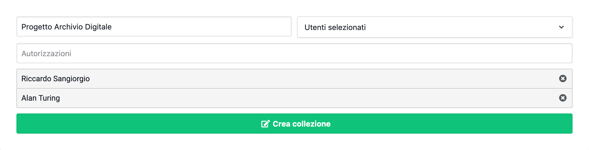

# Crea collezioni

<link rel="stylesheet" href="https://use.fontawesome.com/releases/v5.6.1/css/all.css" integrity="sha384-gfdkjb5BdAXd+lj+gudLWI+BXq4IuLW5IT+brZEZsLFm++aCMlF1V92rMkPaX4PP" crossorigin="anonymous">

Nel menù Servizi della sezione Collezioni è possibile selezionare lo strumento [Crea collezioni](/collections/create).
Nella sezione [Crea collezioni](/collections/create) è possibile creare nella piattaforma una nuova collezione con lo scopo di raggruppare più documenti inerenti ad un medesimo corso o ad un determinato progetto.

- **Titolo (*):** Il titolo della collezione.
- **Permessi (modifica) (*):** La Visibilità del documento si riferisce alla possibilità di rendere pubblico o meno il documento. I valori possibili sono tre:
    - **Tutti (default):** La collezione è modificabile da tutti gli utenti iscritti alla piattaforma.
    - **Per Materia:** //.
    - **Utenti selezionati:** Il documento è accessibile solo dagli utenti registrati e modificabile dagli stessi.

Se si seleziona l'opzione *Utenti selezionati*, comparirà un altro campo nel quale sarà possibile indicare gli utenti a cui sarà conentita la modifica della collezione.

Una volta compilati i campi richiesti, per creare la collezione è necessario cliccare sul pulsante *Crea Collezione (:fas fa-edit:)* e attendere il completamento dell'operazione.

*(\*) I campi sono obbligatori.*
