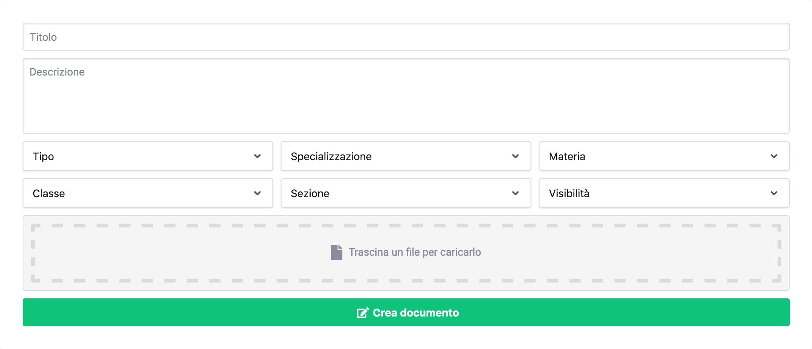

# Crea documenti

<link rel="stylesheet" href="https://use.fontawesome.com/releases/v5.6.1/css/all.css" integrity="sha384-gfdkjb5BdAXd+lj+gudLWI+BXq4IuLW5IT+brZEZsLFm++aCMlF1V92rMkPaX4PP" crossorigin="anonymous">
Nel menù Servizi della sezione Documenti è possibile selezionare lo strumento Crea documenti.
Nella sezione Crea Documenti è possibile caricare nella piattaforma un nuovo documento, descrivendolo con i vari campi messi a disposizione.

- **Titolo (*):** Il titolo del documento. Quando viene selezionato un file nel Box Seleziona File, il campo viene automaticamente compilato con il nome dello stesso.
- **Descrizione:**: Una descrizione più approfondita del documento.
- **Tipo (*):** Il tipo descrive la destinazione d'uso del documento.
- **Specializzazione (*):** L'indirizzo di studio pertinente al documento.
- **Materia (*):** La materia pertinente al documento.
- **Classe:** Classe a cui è destinato il documento (es. tutte le classi classi terze).
- **Sezione:** Sezione a cui è destinato il documento (es. il corso A, B, C, ecc.).
- **Visibilità (*):** La Visibilità del documento si riferisce alla possibilità di rendere pubblico o meno il documento. I valori possibili sono tre:
    - **Pubblico (default):**: Il documento è accessibile pubblicamente, ma modificabile solo dagli utenti registrati.
    - **Area Riservata:** Il documento è accessibile solo dagli utenti registrati e modificabile dagli stessi.
    - **Per Materia:** Il documento è accessibile solo agli utenti registrati e che hanno tra le Autorizzazioni la Materia scelta per il Documento ed è modificabile dagli stessi.
- **Box Seleziona File (*):** Per selezionare un file è possibile cliccare sul box oppure trascinare un file al suo interno.

Una volta compilati i dati richiesti, per caricare il documento è necessario cliccare sul pulsante Crea Documento (:fas fa-edit:) e attendere il completamento dell'operazione.

*(\*) I campi sono obbligatori.*